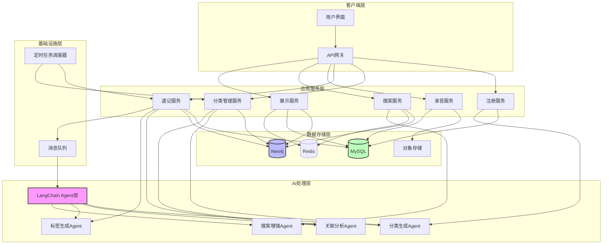

# 速记软件系统架构图

```mermaid
graph TB
    subgraph 客户端层
        A[用户界面] --> B[API网关]
    end
    
    subgraph 应用服务层
        B --> C[注册服务]
        B --> D[分类管理服务]
        B --> E[速记服务]
        B --> F[录音服务]
        B --> G[搜索服务]
        B --> H[展示服务]
    end
    
    subgraph AI处理层
        I[LangChain Agent层]
        I --> I1[分类生成Agent]
        I --> I2[关联分析Agent]
        I --> I3[标签生成Agent]
        I --> I4[搜索增强Agent]
    end
    
    subgraph 数据存储层
        J[(MySQL)]
        K[(Neo4j)]
        L[(Redis)]
        M[对象存储]
    end
    
    subgraph 基础设施层
        N[定时任务调度器]
        O[消息队列]
    end
    
    C --> J
    C --> I1
    
    D --> K
    D --> I1
    D --> I2
    
    E --> J
    E --> K
    E --> I2
    E --> I3
    E --> O
    
    F --> M
    F --> J
    
    G --> K
    G --> L
    G --> I4
    
    H --> K
    H --> J
    H --> L
    
    N --> E
    N --> D
    O --> I
    
    style I fill:#f9f,stroke:#333,stroke-width:2px
    style K fill:#bbf,stroke:#333,stroke-width:2px
    style J fill:#bfb,stroke:#333,stroke-width:2px
```

## 技术栈说明

- **MySQL**: 存储用户信息、会话信息、速记基础数据
- **Neo4j**: 存储笔记分类、标签、事件关系图谱
- **Redis**: 缓存热点数据、会话管理、搜索结果缓存
- **LangChain**: AI能力集成，用于分类生成、关联分析、标签生成、智能搜索
- **定时任务**: 关系更新、数据同步、过期数据清理
