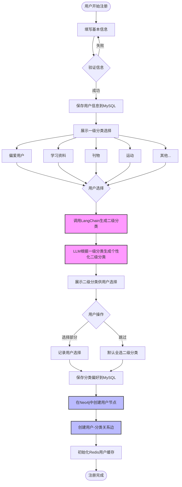

# 注册模块详细流程



## 数据模型

### MySQL - users表
```sql
CREATE TABLE users (
    id BIGINT PRIMARY KEY AUTO_INCREMENT,
    username VARCHAR(100) NOT NULL UNIQUE,
    email VARCHAR(255) NOT NULL UNIQUE,
    password_hash VARCHAR(255) NOT NULL,
    created_at TIMESTAMP DEFAULT CURRENT_TIMESTAMP,
    updated_at TIMESTAMP DEFAULT CURRENT_TIMESTAMP ON UPDATE CURRENT_TIMESTAMP,
    INDEX idx_email (email)
);

CREATE TABLE user_preferences (
    id BIGINT PRIMARY KEY AUTO_INCREMENT,
    user_id BIGINT NOT NULL,
    category_level_1 VARCHAR(50) NOT NULL,
    category_level_2 TEXT, -- JSON array
    created_at TIMESTAMP DEFAULT CURRENT_TIMESTAMP,
    FOREIGN KEY (user_id) REFERENCES users(id) ON DELETE CASCADE
);
```

### Neo4j - 用户和分类节点
```cypher
// 创建用户节点
CREATE (u:User {
    id: $userId,
    username: $username,
    created_at: datetime()
})

// 创建分类节点
CREATE (c1:Category {
    id: $categoryId,
    name: $categoryName,
    level: 1,
    created_at: datetime()
})

CREATE (c2:Category {
    id: $subCategoryId,
    name: $subCategoryName,
    level: 2,
    parent_id: $categoryId,
    created_at: datetime()
})

// 创建关系
CREATE (u)-[:PREFERS {weight: 1.0}]->(c1)
CREATE (u)-[:PREFERS {weight: 0.8}]->(c2)
CREATE (c2)-[:BELONGS_TO]->(c1)
```
