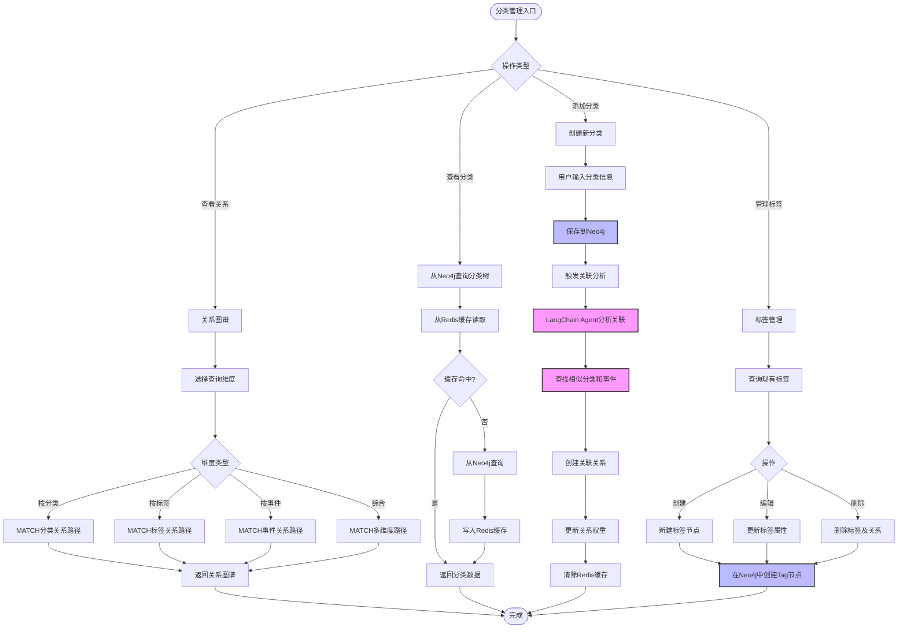

# 分类模块详细流程



## 分类体系设计

### Neo4j图数据模型

```cypher
// 节点类型
(:User)           // 用户
(:Category)       // 分类
(:Tag)           // 标签
(:Event)         // 事件
(:Note)          // 速记

// 关系类型
-[:PREFERS]->           // 用户偏好分类
-[:BELONGS_TO]->        // 属于某个分类
-[:TAGGED_WITH]->       // 标记了某个标签
-[:RELATED_TO]->        // 相关联
-[:SIMILAR_TO]->        // 相似
-[:TRIGGERED_BY]->      // 由某事件触发
-[:CONTAINS]->          // 包含
-[:DEPENDS_ON]->        // 依赖于
```

### 多维度查询示例

#### 1. 按分类查询
```cypher
MATCH path = (u:User {id: $userId})-[:PREFERS]->(c:Category)<-[:BELONGS_TO*1..3]-(n:Note)
WHERE n.created_at > $startDate
RETURN path
```

#### 2. 按标签查询
```cypher
MATCH path = (u:User {id: $userId})-[:CREATED]->(n:Note)-[:TAGGED_WITH]->(t:Tag)
WHERE t.name IN $tagList
RETURN path, n, t
ORDER BY n.created_at DESC
```

#### 3. 按事件关联查询
```cypher
MATCH path = (e:Event {id: $eventId})-[:RELATED_TO*1..2]-(n:Note)
RETURN path, n
ORDER BY path.weight DESC
```

#### 4. 综合维度查询（最复杂）
```cypher
MATCH (u:User {id: $userId})
OPTIONAL MATCH path1 = (u)-[:CREATED]->(n:Note)-[:BELONGS_TO]->(c:Category)
OPTIONAL MATCH path2 = (n)-[:TAGGED_WITH]->(t:Tag)
OPTIONAL MATCH path3 = (n)-[:RELATED_TO]->(e:Event)
WHERE (c.name IN $categories OR $categories IS NULL)
  AND (t.name IN $tags OR $tags IS NULL)
  AND (e.id IN $events OR $events IS NULL)
  AND n.created_at BETWEEN $startDate AND $endDate
RETURN DISTINCT n, 
       collect(DISTINCT c) as categories,
       collect(DISTINCT t) as tags,
       collect(DISTINCT e) as events
ORDER BY n.created_at DESC
LIMIT 50
```

## LangChain关联分析Agent

```python
from langchain.agents import AgentExecutor, create_openai_functions_agent
from langchain.tools import Tool

# 关联分析工具
def find_related_items(query: str, item_type: str) -> list:
    """
    查找相关的分类、标签或事件
    """
    # 1. 向量相似度搜索
    # 2. Neo4j图遍历
    # 3. 返回相关项列表
    pass

# 创建Agent
agent = create_openai_functions_agent(
    llm=llm,
    tools=[
        Tool(
            name="find_related_categories",
            func=lambda q: find_related_items(q, "category"),
            description="查找相关的分类"
        ),
        Tool(
            name="find_related_events",
            func=lambda q: find_related_items(q, "event"),
            description="查找相关的事件"
        )
    ],
    prompt=prompt
)
```
