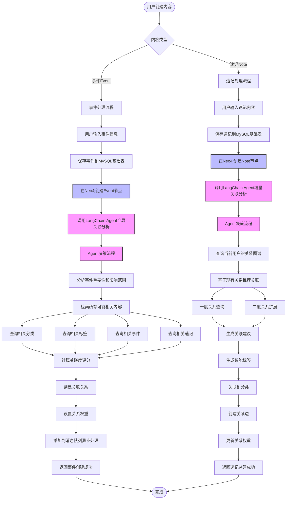
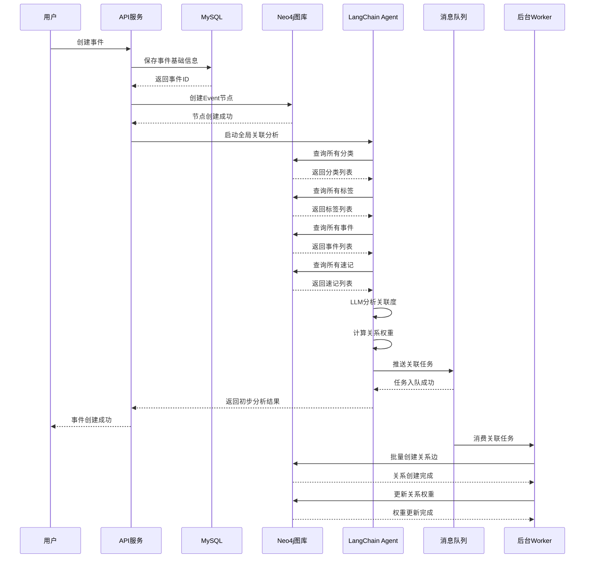
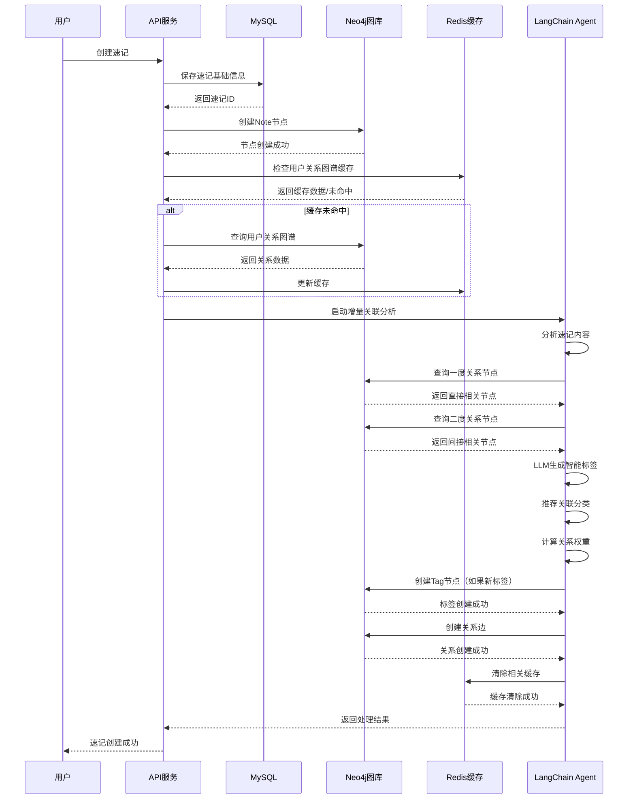

# 速记模块详细流程

## 整体流程对比



## 事件处理详细流程



## 速记处理详细流程



## 数据模型

### MySQL表结构

```sql
-- 事件表
CREATE TABLE events (
    id BIGINT PRIMARY KEY AUTO_INCREMENT,
    user_id BIGINT NOT NULL,
    title VARCHAR(255) NOT NULL,
    description TEXT,
    event_type ENUM('project', 'long_term_task', 'important_event', 'personality') NOT NULL,
    status ENUM('pending', 'in_progress', 'completed', 'cancelled') DEFAULT 'pending',
    priority INT DEFAULT 0,
    start_date DATE,
    end_date DATE,
    created_at TIMESTAMP DEFAULT CURRENT_TIMESTAMP,
    updated_at TIMESTAMP DEFAULT CURRENT_TIMESTAMP ON UPDATE CURRENT_TIMESTAMP,
    INDEX idx_user_id (user_id),
    INDEX idx_status (status),
    INDEX idx_created_at (created_at),
    FOREIGN KEY (user_id) REFERENCES users(id) ON DELETE CASCADE
);

-- 速记表
CREATE TABLE notes (
    id BIGINT PRIMARY KEY AUTO_INCREMENT,
    user_id BIGINT NOT NULL,
    title VARCHAR(255),
    content TEXT NOT NULL,
    source ENUM('text', 'audio', 'image') DEFAULT 'text',
    audio_url VARCHAR(500),
    created_at TIMESTAMP DEFAULT CURRENT_TIMESTAMP,
    updated_at TIMESTAMP DEFAULT CURRENT_TIMESTAMP ON UPDATE CURRENT_TIMESTAMP,
    INDEX idx_user_id (user_id),
    INDEX idx_created_at (created_at),
    FOREIGN KEY (user_id) REFERENCES users(id) ON DELETE CASCADE
);

-- 关联任务队列表
CREATE TABLE relation_tasks (
    id BIGINT PRIMARY KEY AUTO_INCREMENT,
    task_type ENUM('event_relation', 'note_relation', 'tag_generation') NOT NULL,
    entity_type VARCHAR(50) NOT NULL,
    entity_id BIGINT NOT NULL,
    status ENUM('pending', 'processing', 'completed', 'failed') DEFAULT 'pending',
    retry_count INT DEFAULT 0,
    error_message TEXT,
    created_at TIMESTAMP DEFAULT CURRENT_TIMESTAMP,
    processed_at TIMESTAMP NULL,
    INDEX idx_status (status),
    INDEX idx_entity (entity_type, entity_id)
);
```

### Neo4j图模型

```cypher
// 事件节点
CREATE (e:Event {
    id: $eventId,
    user_id: $userId,
    title: $title,
    description: $description,
    event_type: $eventType,
    priority: $priority,
    created_at: datetime()
})

// 速记节点
CREATE (n:Note {
    id: $noteId,
    user_id: $userId,
    title: $title,
    content: $content,
    source: $source,
    created_at: datetime()
})

// 关系类型及属性
// 事件关系
-[:RELATED_TO {weight: 0.85, reason: 'topic_similarity'}]->
-[:TRIGGERED_BY {weight: 0.90, timestamp: datetime()}]->
-[:DEPENDS_ON {weight: 0.75, dependency_type: 'resource'}]->
-[:BLOCKS {weight: 0.70}]->

// 速记关系
-[:MENTIONS {weight: 0.80, context: 'reference'}]->
-[:EXTENDS {weight: 0.85, extension_type: 'detail'}]->
-[:CONTRADICTS {weight: 0.60}]->

// 通用关系
-[:TAGGED_WITH {confidence: 0.95, auto_generated: true}]->
-[:BELONGS_TO {weight: 1.0}]->
-[:CREATED_BY]->
```

## LangChain Agent实现

### 事件关联Agent

```python
from langchain.agents import AgentExecutor
from langchain.prompts import ChatPromptTemplate
from langchain.tools import tool

@tool
def search_all_content(event_info: dict) -> dict:
    """搜索所有可能相关的内容"""
    results = {
        'categories': [],
        'tags': [],
        'events': [],
        'notes': []
    }
    
    # 向量检索 + 关键词匹配
    # ... 实现逻辑
    
    return results

@tool
def calculate_relevance(source: dict, targets: list) -> list:
    """计算关联度评分"""
    scores = []
    for target in targets:
        # 使用LLM计算语义相似度
        score = llm.predict(
            f"计算以下两个内容的关联度(0-1):\n源:{source}\n目标:{target}"
        )
        scores.append({
            'target': target,
            'score': float(score),
            'reason': '...'
        })
    return scores

event_agent_prompt = ChatPromptTemplate.from_messages([
    ("system", """你是一个事件关联分析专家。
    任务：分析新创建的事件，找出所有可能相关的内容并建立关联。
    
    分析维度：
    1. 主题相关性
    2. 时间关联
    3. 因果关系
    4. 资源依赖
    5. 情感影响
    
    输出：关联关系列表，包含关系类型、权重和理由。
    """),
    ("user", "{input}")
])

event_agent = create_agent(
    llm=llm,
    tools=[search_all_content, calculate_relevance],
    prompt=event_agent_prompt
)
```

### 速记关联Agent

```python
@tool
def query_user_graph(user_id: int, note_content: str) -> dict:
    """查询用户的关系图谱"""
    # 从Neo4j查询用户的现有关系
    query = """
    MATCH (u:User {id: $userId})-[r*1..2]-(n)
    WHERE n:Category OR n:Tag OR n:Event OR n:Note
    RETURN n, type(r), properties(r)
    LIMIT 100
    """
    return neo4j_client.run(query, userId=user_id)

@tool
def generate_smart_tags(content: str, existing_tags: list) -> list:
    """生成智能标签"""
    prompt = f"""
    基于以下内容生成3-5个标签：
    内容：{content}
    
    现有标签参考（优先使用）：{existing_tags}
    
    要求：
    1. 标签要准确反映除内容主题
    2. 优先使用现有标签
    3. 新标签要简洁明了
    """
    tags = llm.predict(prompt)
    return parse_tags(tags)

note_agent_prompt = ChatPromptTemplate.from_messages([
    ("system", """你是速记关联分析专家。
    任务：基于用户现有的关系图谱，为新创建的速记建立智能关联。
    
    策略：
    1. 首先查询用户的一度关系（直接相关）
    2. 扩展到二度关系（间接相关）
    3. 基于关系权重和内容相似度推荐关联
    4. 自动生成智能标签
    5. 关联到合适的分类
    
    输出：建议的关联关系、生成的新标签、推荐的分类。
    """),
    ("user", "{input}")
])

note_agent = create_agent(
    llm=llm,
    tools=[query_user_graph, generate_smart_tags],
    prompt=note_agent_prompt
)
```
