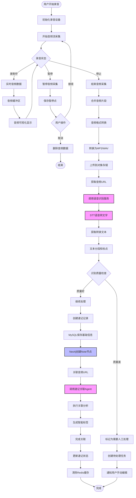
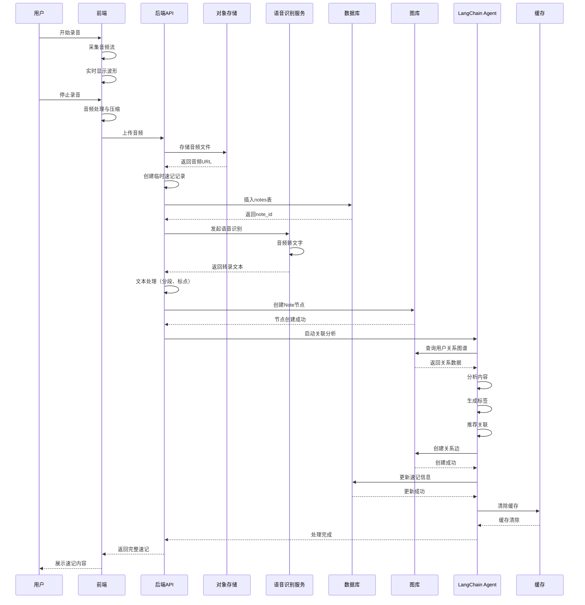

# 录音模块详细流程



## 录音处理时序图



## 数据模型

### MySQL表结构

```sql
-- 录音任务表
CREATE TABLE audio_recordings (
    id BIGINT PRIMARY KEY AUTO_INCREMENT,
    user_id BIGINT NOT NULL,
    note_id BIGINT NOT NULL,
    audio_url VARCHAR(500) NOT NULL,
    audio_duration INT DEFAULT 0, -- 秒
    audio_size BIGINT DEFAULT 0, -- 字节
    audio_format VARCHAR(20) DEFAULT 'mp3',
    sample_rate INT DEFAULT 16000,
    channels INT DEFAULT 1,
    status ENUM('uploading', 'processing', 'completed', 'failed') DEFAULT 'uploading',
    transcript_status ENUM('pending', 'processing', 'completed', 'manual_review') DEFAULT 'pending',
    transcript_text TEXT,
    transcript_confidence DECIMAL(3,2) DEFAULT 0.00,
    created_at TIMESTAMP DEFAULT CURRENT_TIMESTAMP,
    updated_at TIMESTAMP DEFAULT CURRENT_TIMESTAMP ON UPDATE CURRENT_TIMESTAMP,
    INDEX idx_user_id (user_id),
    INDEX idx_note_id (note_id),
    INDEX idx_status (status),
    FOREIGN KEY (user_id) REFERENCES users(id) ON DELETE CASCADE,
    FOREIGN KEY (note_id) REFERENCES notes(id) ON DELETE CASCADE
);

-- 转录分段表（用于长音频分段）
CREATE TABLE transcript_segments (
    id BIGINT PRIMARY KEY AUTO_INCREMENT,
    recording_id BIGINT NOT NULL,
    segment_index INT NOT NULL,
    start_time DECIMAL(10,2) NOT NULL, -- 秒
    end_time DECIMAL(10,2) NOT NULL,
    text TEXT NOT NULL,
    confidence DECIMAL(3,2),
    speaker VARCHAR(50), -- 说话人识别
    created_at TIMESTAMP DEFAULT CURRENT_TIMESTAMP,
    INDEX idx_recording_id (recording_id),
    FOREIGN KEY (recording_id) REFERENCES audio_recordings(id) ON DELETE CASCADE
);
```

### 音频处理配置

```yaml
audio_processing:
  chunk_duration: 30  # 分块时长（秒）
  sample_rate: 16000  # 采样率
  channels: 1         # 声道数
  bitrate: 128k       # 比特率
  format: mp3         # 输出格式
  
  # 支持的格式
  supported_formats:
    - mp3
    - wav
    - m4a
    - aac
  
  # STT服务配置
  stt_service: openai_whisper
  stt_model: base
  stt_language: zh-CN
  enable_punctuation: true
  enable_segmentation: true
```

## 语音识别Agent

```python
from langchain.agents import AgentExecutor

class TranscriptionAgent:
    """转录与处理Agent"""
    
    def __init__(self, stt_client, llm):
        self.stt_client = stt_client
        self.llm = llm
    
    def process_audio(self, audio_file_path: str) -> dict:
        """处理音频文件"""
        # 1. 音频预处理
        processed_audio = self._preprocess_audio(audio_file_path)
        
        # 2. 语音转文字
        transcription = self._transcribe(processed_audio)
        
        # 3. 文本后处理
        processed_text = self._post_process_text(transcription)
        
        # 4. 质量评估
        quality_score = self._assess_quality(processed_text)
        
        return {
            'text': processed_text,
            'confidence': transcription['confidence'],
            'quality_score': quality_score,
            'needs_manual_review': quality_score < 0.7,
            'segments': transcription['segments']
        }
    
    def _transcribe(self, audio_data: bytes) -> dict:
        """调用STT服务"""
        response = self.stt_client.audio.transcriptions.create(
            model="whisper-1",
            file=audio_data,
            language="zh",
            response_format="verbose_json"
        )
        
        return {
            'text': response.text,
            'segments': response.segments,
            'confidence': self._calculate_confidence(response.segments)
        }
    
    def _post_process_text(self, transcription: str) -> str:
        """文本后处理：分段、标点"""
        prompt = f"""
        对以下转录文本进行优化：
        1. 添加适当的标点符号
        2. 合理分段
        3. 修正明显的识别错误
        
        原文：{transcription}
        
        输出优化后的文本：
        """
        return self.llm.predict(prompt)
    
    def _assess_quality(self, text: str) -> float:
        """评估转录质量"""
        prompt = f"""
        评估以下语音转录的质量（0-1分）：
        文本：{text}
        
        评估维度：
        1. 语义连贯性
        2. 语法正确性
        3. 是否有明显错误
        
        只返回数字评分。
        """
        score = self.llm.predict(prompt)
        return float(score)
```

## 对象存储集成

```python
import oss2

class AudioStorage:
    """音频存储管理"""
    
    def __init__(self, config):
        self.auth = oss2.Auth(config['access_key'], config['secret_key'])
        self.bucket = oss2.Bucket(self.auth, config['endpoint'], config['bucket'])
    
    def upload_audio(self, file_path: str, user_id: int) -> str:
        """上传音频文件"""
        # 生成唯一文件名
        filename = f"audio/{user_id}/{uuid.uuid4()}.mp3"
        
        # 上传文件
        result = self.bucket.put_object_from_file(filename, file_path)
        
        # 返回公开访问URL
        return f"{self.bucket.endpoint}/{self.bucket.bucket_name}/{filename}"
    
    def get_signed_url(self, object_key: str, expires: int = 3600) -> str:
        """生成签名URL（私有访问）"""
        return self.bucket.sign_url('GET', object_key, expires)
```
