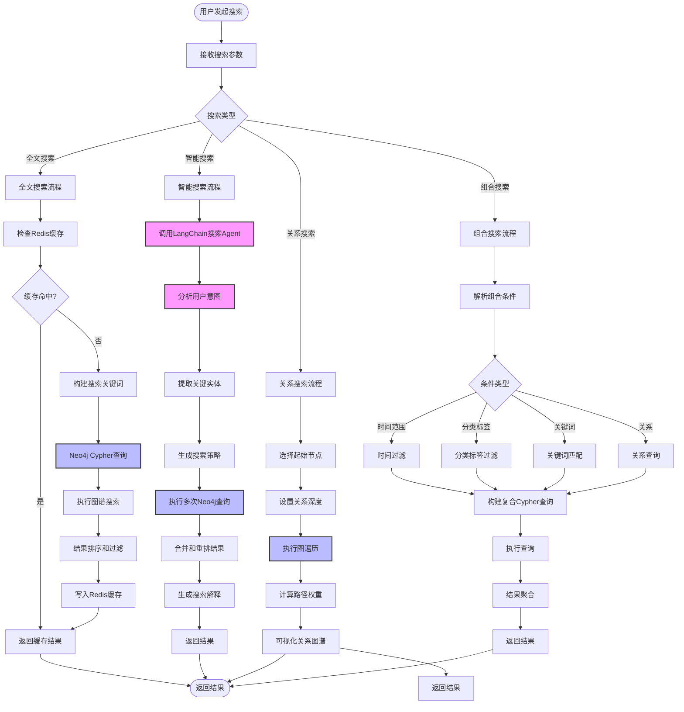
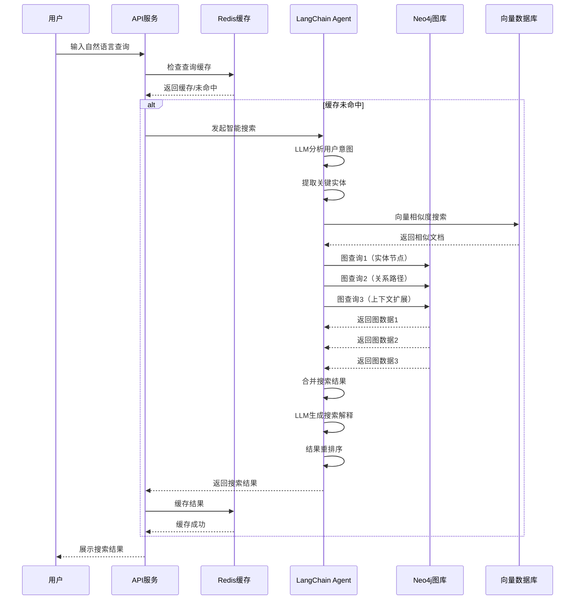

# 搜索模块详细流程



## 智能搜索Agent流程



## Neo4j搜索查询模板

### 1. 全文搜索（Cypher全文索引）

```cypher
// 创建全文索引
CREATE FULLTEXT INDEX note_fulltext FOR (n:Note) ON EACH [n.title, n.content]
CREATE FULLTEXT INDEX event_fulltext FOR (e:Event) ON EACH [e.title, e.description]

// 执行全文搜索
CALL db.index.fulltext.queryNodes('note_fulltext', '搜索关键词') YIELD node, score
MATCH (node)-[r*1..2]-(related)
RETURN node, score, related, relationships(r)
ORDER BY score DESC
LIMIT 50
```

### 2. 关系搜索（图遍历）

```cypher
// 按关系深度搜索
MATCH path = (u:User {id: $userId})-[*1..3]-(target)
WHERE target:Note OR target:Event
WITH path, target, 
     reduce(score = 0.0, r IN relationships(path) | score + r.weight) AS pathScore
RETURN target, pathScore, path
ORDER BY pathScore DESC
LIMIT 20
```

### 3. 多维度组合搜索

```cypher
// 组合搜索：分类 + 标签 + 时间 + 关键词
MATCH (u:User {id: $userId})
OPTIONAL MATCH (u)-[:CREATED]->(n:Note)
OPTIONAL MATCH (u)-[:CREATED]->(e:Event)

WHERE (n:Note OR e:Event)
  AND ($categories IS NULL OR (n)-[:BELONGS_TO]->(:Category {name: $categories}))
  AND ($tags IS NULL OR (n)-[:TAGGED_WITH]->(:Tag {name: $tags}))
  AND ($startDate IS NULL OR (n.created_at >= date($startDate)))
  AND ($endDate IS NULL OR (n.created_at <= date($endDate)))
  AND ($keyword IS NULL OR 
      (n.title CONTAINS $keyword OR n.content CONTAINS $keyword OR 
       e.title CONTAINS $keyword OR e.description CONTAINS $keyword))

WITH collect(DISTINCT n) + collect(DISTINCT e) as results
UNWIND results as item
OPTIONAL MATCH (item)-[r:RELATED_TO|:TAGGED_WITH|:BELONGS_TO]-(related)
RETURN item, 
       item.title as title,
       item.content as content,
       item.created_at as created_at,
       collect(DISTINCT related) as related_items
ORDER BY item.created_at DESC
LIMIT 50
```

### 4. 上下文扩展搜索

```cypher
// 基于种子节点扩展搜索
MATCH (seed:Note {id: $seedId})
// 查询一度关系
MATCH (seed)-[r1:RELATED_TO|:MENTIONS|:EXTENDS]->(n1:Note)
WHERE r1.weight > 0.5
// 查询二度关系
OPTIONAL MATCH (n1)-[r2:RELATED_TO]->(n2:Note)
WHERE r2.weight > 0.7

WITH seed, collect(DISTINCT n1) as first_degree, collect(DISTINCT n2) as second_degree
UNWIND first_degree + second_degree as related
RETURN related, 
       [ (seed)-[r]-(related) | {type: type(r), weight: r.weight} ] as relations
```

## LangChain搜索Agent实现

```python
from langchain.agents import AgentExecutor, create_openai_functions_agent
from langchain.prompts import ChatPromptTemplate
from langchain.vectorstores import Neo4jVector
from langchain.embeddings import OpenAIEmbeddings

@tool
def analyze_search_intent(query: str) -> dict:
    """分析搜索意图"""
    prompt = f"""
    分析用户搜索意图，提取以下信息：
    查询：{query}
    
    返回JSON格式：
    {{
        "intent": "search_type",
        "entities": ["entity1", "entity2"],
        "categories": ["category1"],
        "tags": ["tag1"],
        "time_range": {{"start": "2024-01-01", "end": "2024-12-31"}},
        "keywords": ["keyword1", "keyword2"]
    }}
    """
    result = llm.predict(prompt)
    return parse_json(result)

@tool
def vector_search(query: str, top_k: int = 10) -> list:
    """向量相似度搜索"""
    vector_store = Neo4jVector.from_existing_index(
        embedding=OpenAIEmbeddings(),
        index_name="note_embedding",
        node_label="Note",
        text_node_property="content"
    )
    
    results = vector_store.similarity_search_with_score(query, k=top_k)
    return [
        {
            'node': result[0].metadata['node_id'],
            'content': result[0].page_content,
            'score': result[1]
        }
        for result in results
    ]

@tool
def graph_search(cypher_query: str) -> list:
    """执行Neo4j图查询"""
    results = neo4j_client.run(cypher_query)
    return results.data()

@tool
def merge_results(vector_results: list, graph_results: list) -> list:
    """合并和重排搜索结果"""
    # 使用LLM进行结果融合和重排序
    merged = {}
    
    # 添加向量搜索结果
    for item in vector_results:
        node_id = item['node']
        if node_id not in merged:
            merged[node_id] = {
                'node_id': node_id,
                'vector_score': item['score'],
                'graph_score': 0,
                'relevance': item['score']
            }
    
    # 添加图搜索结果
    for item in graph_results:
        node_id = item['id']
        if node_id not in merged:
            merged[node_id] = {
                'node_id': node_id,
                'vector_score': 0,
                'graph_score': item.get('score', 0.5),
                'relevance': item.get('score', 0.5)
            }
        else:
            merged[node_id]['graph_score'] = item.get('score', 0.5)
            # 融合分数
            merged[node_id]['relevance'] = (
                merged[node_id]['vector_score'] * 0.6 + 
                merged[node_id]['graph_score'] * 0.4
            )
    
    # 排序
    sorted_results = sorted(
        merged.values(),
        key=lambda x: x['relevance'],
        reverse=True
    )
    
    return sorted_results[:20]

search_agent_prompt = ChatPromptTemplate.from_messages([
    ("system", """你是智能搜索专家。
    任务：理解用户的自然语言查询，执行多维度搜索，返回最相关的结果。
    
    搜索策略：
    1. 分析用户意图，提取关键信息
    2. 使用向量搜索找到语义相似的内容
    3. 使用图搜索找到关系关联的内容
    4. 合并和重排结果
    5. 生成搜索结果的自然语言解释
    
    输出格式：
    {{
        "results": [...],
        "explanation": "搜索结果的自然语言解释",
        "suggestions": ["相关搜索建议"]
    }}
    """),
    ("human", "{input}"),
    ("agent", "{agent_scratchpad}")
])

# 创建搜索Agent
search_agent = create_openai_functions_agent(
    llm=llm,
    tools=[analyze_search_intent, vector_search, graph_search, merge_results],
    prompt=search_agent_prompt
)

search_executor = AgentExecutor(
    agent=search_agent,
    tools=[analyze_search_intent, vector_search, graph_search, merge_results],
    verbose=True,
    handle_parsing_errors=True
)
```

## 搜索API实现

```python
from fastapi import FastAPI, Query
from typing import Optional, List

app = FastAPI()

@app.post("/api/search")
async def search(
    query: str,
    search_type: Optional[str] = "smart",
    categories: Optional[List[str]] = None,
    tags: Optional[List[str]] = None,
    start_date: Optional[str] = None,
    end_date: Optional[str] = None,
    limit: int = 50
):
    """
    搜索接口
    
    参数：
    - query: 搜索关键词或自然语言查询
    - search_type: 搜索类型（fulltext, smart, graph, combined）
    - categories: 分类过滤
    - tags: 标签过滤
    - start_date: 开始日期
    - end_date: 结束日期
    - limit: 结果数量限制
    """
    # 检查缓存
    cache_key = generate_cache_key(query, search_type, categories, tags, start_date, end_date)
    cached_result = redis_client.get(cache_key)
    
    if cached_result:
        return json.loads(cached_result)
    
    # 执行搜索
    if search_type == "smart":
        result = await smart_search(query)
    elif search_type == "graph":
        result = await graph_search(query)
    elif search_type == "fulltext":
        result = await fulltext_search(query)
    else:
        result = await combined_search(
            query, categories, tags, start_date, end_date, limit
        )
    
    # 缓存结果
    redis_client.setex(cache_key, 300, json.dumps(result))
    
    return result

async def smart_search(query: str, user_id: int):
    """智能搜索"""
    # 调用LangChain Agent
    agent_input = {
        "input": f"用户查询：{query}\n用户ID：{user_id}\n请执行智能搜索。"
    }
    
    result = await search_executor.ainvoke(agent_input)
    
    return {
        "results": result["output"]["results"],
        "explanation": result["output"]["explanation"],
        "suggestions": result["output"]["suggestions"],
        "query": query
    }
```

## Redis缓存策略

```python
import redis
from datetime import timedelta

class SearchCache:
    """搜索缓存管理"""
    
    def __init__(self, redis_client):
        self.redis = redis_client
        self.default_ttl = timedelta(minutes=5)
        
    def generate_key(self, query: str, filters: dict) -> str:
        """生成缓存键"""
        import hashlib
        cache_data = {'query': query, 'filters': filters}
        cache_str = json.dumps(cache_data, sort_keys=True)
        return f"search:{hashlib.md5(cache_str.encode()).hexdigest()}"
    
    def get(self, key: str) -> Optional[dict]:
        """获取缓存"""
        cached = self.redis.get(key)
        if cached:
            return json.loads(cached)
        return None
    
    def set(self, key: str, result: dict, ttl: timedelta = None):
        """设置缓存"""
        ttl = ttl or self.default_ttl
        self.redis.setex(key, ttl, json.dumps(result))
    
    def invalidate_user_cache(self, user_id: int):
        """清除用户相关缓存"""
        pattern = f"search:*user:{user_id}*"
        keys = self.redis.keys(pattern)
        if keys:
            self.redis.delete(*keys)
```
