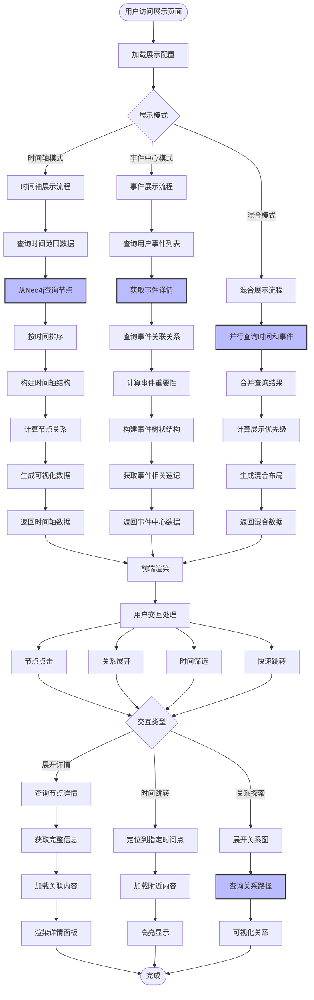
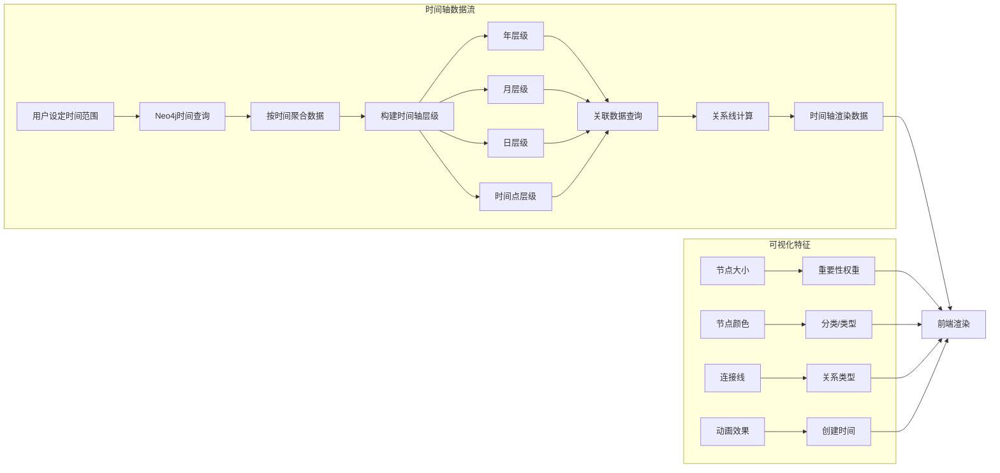
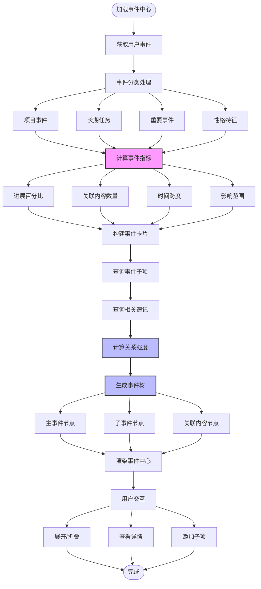

# 展示模块详细流程



## 时间轴展示详细设计



## 事件中心展示详细设计



## 数据查询实现

### 时间轴查询

```python
async def get_timeline_data(
    user_id: int,
    start_date: str,
    end_date: str,
    granularity: str = "day"
) -> dict:
    """
    获取时间轴数据
    
    参数：
    - user_id: 用户ID
    - start_date: 开始日期
    - end_date: 结束日期
    - granularity: 粒度（year, month, day）
    """
    
    # Neo4j查询
    cypher = f"""
    MATCH (u:User {{id: $userId}})-[:CREATED]->(n)
    WHERE (n:Note OR n:Event OR n:Activity)
      AND n.created_at >= date($startDate)
      AND n.created_at <= date($endDate)
      
    WITH n, 
         CASE granularity
           WHEN 'year' THEN n.created_at.year
           WHEN 'month' THEN n.created_at.year * 100 + n.created_at.month
           ELSE n.created_at.year * 10000 + n.created_at.month * 100 + n.created_at.day
         END as time_key
    
    OPTIONAL MATCH (n)-[r]->(related)
    
    RETURN n,
           time_key,
           collect(DISTINCT {{
               id: related.id,
               type: labels(related)[0],
               title: related.title,
               relation_type: type(r),
               weight: r.weight
           }}) as relations
    ORDER BY time_key DESC, n.created_at DESC
    """
    
    results = neo4j_client.run(cypher, {
        'userId': user_id,
        'startDate': start_date,
        'endDate': end_date,
        'granularity': granularity
    }).data()
    
    # 按时间键分组
    timeline = {}
    for item in results:
        key = item['time_key']
        if key not in timeline:
            timeline[key] = {
                'time_key': key,
                'items': []
            }
        
        timeline[key]['items'].append({
            'id': item['n']['id'],
            'type': item['n'].labels[0],
            'title': item['n']['title'],
            'content': item['n'].get('content'),
            'created_at': str(item['n']['created_at']),
            'relations': item['relations']
        })
    
    return {
        'timeline': sorted(timeline.values(), key=lambda x: x['time_key'], reverse=True),
        'summary': calculate_summary(results)
    }

def calculate_summary(results: list) -> dict:
    """计算统计数据"""
    return {
        'total_items': len(results),
        'notes_count': len([r for r in results if 'Note' in r['n'].labels]),
        'events_count': len([r for r in results if 'Event' in r['n'].labels]),
        'total_relations': sum(len(r['relations']) for r in results)
    }
```

### 事件中心查询

```python
async def get_event_center(user_id: int) -> dict:
    """获取事件中心数据"""
    
    # 查询所有事件
    events_query = """
    MATCH (u:User {id: $userId})-[:CREATED]->(e:Event)
    WITH e,
         CASE e.event_type
           WHEN 'project' THEN 1
           WHEN 'long_term_task' THEN 2
           WHEN 'important_event' THEN 3
           ELSE 4
         END as priority
    
    ORDER BY priority, e.created_at DESC
    RETURN e, priority
    """
    
    events = neo4j_client.run(events_query, {'userId': user_id}).data()
    
    # 构建事件树
    event_tree = []
    for event_data in events:
        event = event_data['e']
        event_id = event['id']
        
        # 查询子事件
        sub_events_query = """
        MATCH (e:Event {id: $eventId})<-[:PARENT_OF]-(sub:Event)
        RETURN sub
        """
        sub_events = neo4j_client.run(sub_events_query, {'eventId': event_id}).data()
        
        # 查询相关速记
        related_notes_query = """
        MATCH (e:Event {id: $eventId})-[:RELATED_TO|:MENTIONS]->(n:Note)
        WITH n, r
        ORDER BY r.weight DESC
        RETURN n, {type: type(r), weight: r.weight} as relation
        LIMIT 20
        """
        related_notes = neo4j_client.run(related_notes_query, {'eventId': event_id}).data()
        
        # 计算进展
        progress = calculate_event_progress(event_id)
        
        event_tree.append({
            'event': {
                'id': event['id'],
                'title': event['title'],
                'type': event['event_type'],
                'status': event['status'],
                'priority': event['priority'],
                'start_date': str(event.get('start_date')),
                'end_date': str(event.get('end_date')),
                'created_at': str(event['created_at'])
            },
            'progress': progress,
            'sub_events': [sub['sub'] for sub in sub_events],
            'related_notes': [
                {
                    'note': note['n'],
                    'relation': note['relation']
                }
                for note in related_notes
            ],
            'statistics': {
                'sub_events_count': len(sub_events),
                'notes_count': len(related_notes),
                'total_relations': len(sub_events) + len(related_notes)
            }
        })
    
    return {
        'events': event_tree,
        'summary': {
            'total_events': len(event_tree),
            'completed': len([e for e in event_tree if e['event']['status'] == 'completed']),
            'in_progress': len([e for e in event_tree if e['event']['status'] == 'in_progress'])
        }
    }

def calculate_event_progress(event_id: int) -> dict:
    """计算事件进展"""
    progress_query = """
    MATCH (e:Event {id: $eventId})
    OPTIONAL MATCH (e)<-[:PARENT_OF]-(sub:Event)
    WITH e, count(sub) as total,
         sum(CASE WHEN sub.status = 'completed' THEN 1 ELSE 0 END) as completed
    
    RETURN total, completed,
           CASE total 
             WHEN 0 THEN 0
             ELSE round(completed * 100.0 / total, 1)
           END as progress_percent
    """
    
    result = neo4j_client.run(progress_query, {'eventId': event_id}).single()
    
    return {
        'total': result['total'],
        'completed': result['completed'],
        'progress_percent': result['progress_percent']
    }
```

## 混合展示查询

```python
async def get_mixed_view(
    user_id: int,
    start_date: str,
    end_date: str,
    min_importance: float = 0.5
) -> dict:
    """获取混合视图数据（时间轴 + 事件中心）"""
    
    # 查询关键节点（重要性阈值以上）
    key_nodes_query = """
    MATCH (u:User {id: $userId})-[:CREATED]->(n)
    WHERE (n:Note OR n:Event)
      AND n.created_at >= date($startDate)
      AND n.created_at <= date($endDate)
    
    // 计算重要性
    WITH n,
         CASE 
           WHEN n:Event THEN n.priority * 0.8 + size((n)<-[:RELATED_TO]-()) * 0.2
           WHEN n:Note THEN size((n)-[:TAGGED_WITH]->()) * 0.3 + size((n)-[:RELATED_TO]->()) * 0.7
           ELSE 0
         END as importance
    
    WHERE importance >= $minImportance
    
    // 查询关系
    OPTIONAL MATCH (n)-[r]->(related)
    
    RETURN n,
           importance,
           collect(DISTINCT {{
               id: related.id,
               type: labels(related)[0],
               title: related.title,
               relation: type(r),
               weight: r.weight
           }}) as relations
    ORDER BY n.created_at DESC
    """
    
    key_nodes = neo4j_client.run(key_nodes_query, {
        'userId': user_id,
        'startDate': start_date,
        'endDate': end_date,
        'minImportance': min_importance
    }).data()
    
    # 构建混合数据结构
    mixed_data = {
        'timeline': [],
        'key_events': [],
        'high_value_notes': []
    }
    
    for item in key_nodes:
        node = item['n']
        importance = item['important']
        
        if 'Event' in node.labels:
            # 添加到关键事件
            mixed_data['key_events'].append({
                'event': node,
                'importance': importance,
                'relations': item['relations']
            })
        
        # 添加到时间轴
        mixed_data['timeline'].append({
            'item': node,
            'type': node.labels[0],
            'importance': importance,
            'timestamp': str(node['created_at']),
            'relations': item['relations']
        })
        
        if importance > 0.8 and 'Note' in node.labels:
            mixed_data['high_value_notes'].append({
                'note': node,
                'importance': importance,
                'relations': item['relations']
            })
    
    return mixed_data
```

## 前端渲染数据格式

```typescript
// 时间轴节点接口
interface TimelineNode {
  id: number;
  type: 'Note' | 'Event' | 'Activity';
  title: string;
  content?: string;
  created_at: string;
  importance: number;
  relations: Relation[];
  visualization: {
    size: number;      // 节点大小
    color: string;     // 节点颜色
    position: { x: number, y: number };
  };
}

// 事件中心接口
interface EventCenter {
  events: EventItem[];
  summary: {
    total_events: number;
    completed: number;
    in_progress: number;
  };
}

interface EventItem {
  event: {
    id: number;
    title: string;
    type: 'project' | 'long_term_task' | 'important_event';
    status: 'pending' | 'in_progress' | 'completed';
    start_date?: string;
    end_date?: string;
  };
  progress: {
    total: number;
    completed: number;
    progress_percent: number;
  };
  sub_events: Event[];
  related_notes: Note[];
  statistics: {
    sub_events_count: number;
    notes_count: number;
    total_relations: number;
  };
}

// 混合视图接口
interface MixedView {
  timeline: TimelineNode[];
  key_events: EventItem[];
  high_value_notes: Note[];
  layout: {
    mode: 'timeline' | 'tree' | 'graph';
    config: any;
  };
}
```

## 关系可视化配置

```javascript
// 可视化配置
const vizConfig = {
  // 事件类型颜色
  eventColors: {
    project: '#FF6B6B',
    long_term_task: '#4ECDC4',
    important_event: '#45B7D1',
    personality: '#96CEB4'
  },
  
  // 关系类型样式
  relationStyles: {
    RELATED_TO: { color: '#666', dash: [], width: 2 },
    DEPENDS_ON: { color: '#FF6B6B', dash: [5, 5], width: 1 },
    TRIGGERED_BY: { color: '#4ECDC4', dash: [], width: 3 },
    TAGGED_WITH: { color: '#45B7D1', dash: [], width: 1 }
  },
  
  // 重要性映射
  importanceToSize: {
    min: 10,
    max: 50,
    threshold: 0.5
  },
  
  // 布局算法
  layout: {
    algorithm: 'force',
    options: {
      linkDistance: 100,
      charge: -300,
      gravity: 0.1
    }
  }
};
```
