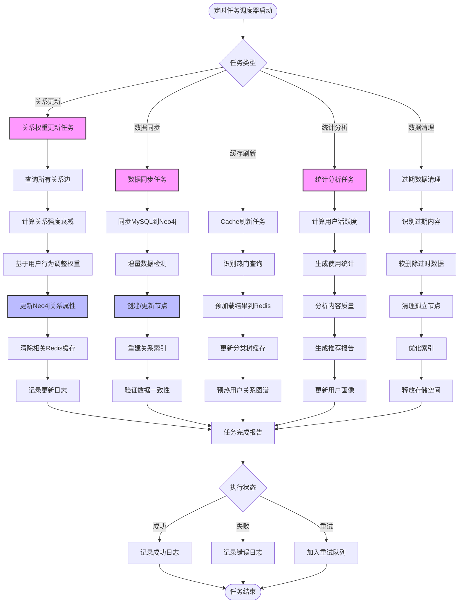
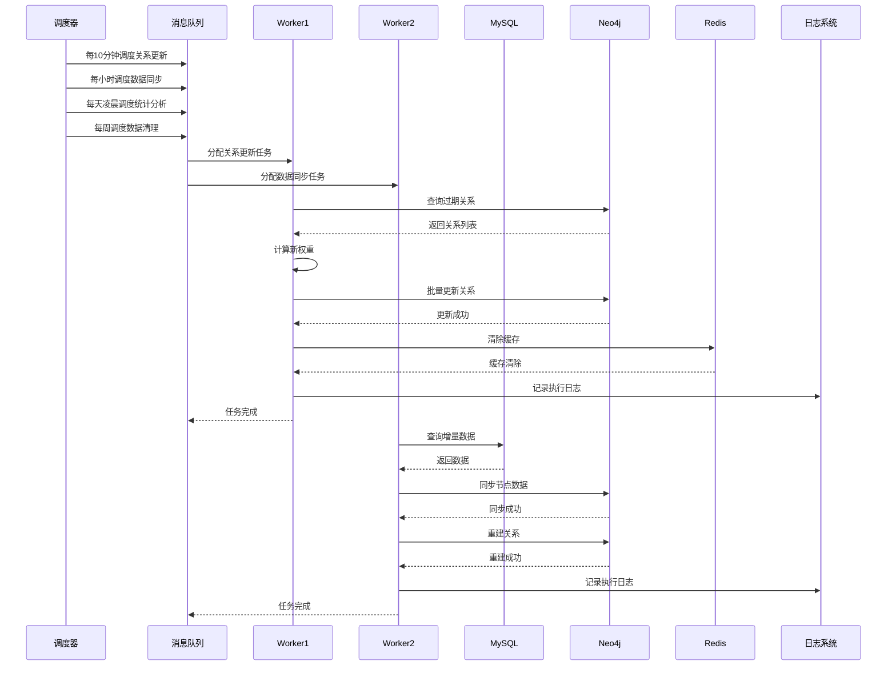

# 定时任务与系统集成流程



## 定时任务调度架构



## 关系权重更新算法

```python
from typing import Dict, List
from datetime import datetime, timedelta

class RelationshipUpdater:
    """关系权重更新器"""
    
    def __init__(self, neo4j_client, redis_client):
        self.neo4j = neo4j_client
        self.redis = redis_client
    
    async def update_all_relationships(self):
        """更新所有关系权重"""
        # 1. 查询所有关系
        query = """
        MATCH (a)-[r]->(b)
        WHERE r.weight IS NOT NULL
          AND r.updated_at < datetime() - duration('P7D')
        RETURN a, r, b, type(r) as rel_type
        """
        relationships = self.neo4j.run(query).data()
        
        # 2. 批量更新
        batch_size = 1000
        for i in range(0, len(relationships), batch_size):
            batch = relationships[i:i+batch_size]
            await self._update_batch(batch)
    
    async def _update_batch(self, batch: List[dict]):
        """批量更新关系权重"""
        for rel in batch:
            # 计算时间衰减
            time_decay = self._calculate_time_decay(rel['r'])
            
            # 计算用户行为影响
            behavior_boost = await self._calculate_behavior_boost(rel)
            
            # 计算新权重
            new_weight = rel['r']['weight'] * time_decay + behavior_boost
            
            # 更新关系
            update_query = """
            MATCH (a)-[r]->(b)
            WHERE id(r) = $relId
            SET r.weight = $newWeight,
                r.updated_at = datetime()
            """
            self.neo4j.run(update_query, {
                'relId': rel['r'].element_id,
                'newWeight': min(max(new_weight, 0), 1)
            })
        
        # 清除相关缓存
        await self._invalidate_caches(batch)
    
    def _calculate_time_decay(self, relation: dict) -> float:
        """计算时间衰减因子"""
        created_at = relation.get('created_at', datetime.now())
        days_old = (datetime.now() - created_at).days
        
        # 7天无交互，权重开始衰减
        if days_old < 7:
            return 1.0
        elif days_old < 30:
            return 0.9
        elif days_old < 90:
            return 0.7
        else:
            return 0.5
    
    async def _calculate_behavior_boost(self, relation: dict) -> float:
        """计算用户行为对权重的影响"""
        # 查询用户最近交互
        query = """
        MATCH (u:User)-[r:INTERACTED_WITH]->(n)
        WHERE id(n) = $nodeId
          AND r.timestamp > datetime() - duration('P30D')
        RETURN count(r) as interaction_count
        """
        result = self.neo4j.run(query, {
            'nodeId': relation['b'].element_id
        }).single()
        
        interaction_count = result['interaction_count']
        
        # 每次交互增加权重
        return min(interaction_count * 0.05, 0.3)
    
    async def _invalidate_caches(self, batch: List[dict]):
        """清除相关缓存"""
        # 提取所有相关的用户ID
        user_ids = set()
        for rel in batch:
            if 'User' in rel['a'].labels:
                user_ids.add(rel['a']['id'])
        
        # 清除用户缓存
        for user_id in user_ids:
            pattern = f"user:{user_id}:*"
            keys = self.redis.keys(pattern)
            if keys:
                self.redis.delete(*keys)
```

## 数据同步任务

```python
class DataSyncer:
    """数据同步器"""
    
    def __init__(self, mysql_client, neo4j_client):
        self.mysql = mysql_client
        self.neo4j = neo4j_client
    
    async def sync_incremental_data(self):
        """同步增量数据"""
        # 1. 查询上次同步时间
        last_sync = self._get_last_sync_time()
        
        # 2. 查询增量数据
        new_notes = await self._get_new_notes(last_sync)
        new_events = await self._get_new_events(last_sync)
        updated_notes = await self._get_updated_notes(last_sync)
        updated_events = await self._get_updated_events(last_sync)
        
        # 3. 同步到Neo4j
        await self._sync_notes(new_notes + updated_notes)
        await self._sync_events(new_events + updated_events)
        
        # 4. 更新同步时间
        self._update_last_sync_time()
    
    async def _sync_notes(self, notes: List[dict]):
        """同步笔记数据"""
        for note in notes:
            # 检查节点是否存在
            check_query = """
            MATCH (n:Note {id: $noteId})
            RETURN n
            """
            existing = self.neo4j.run(check_query, {'noteId': note['id']}).single()
            
            if existing:
                # 更新节点
                update_query = """
                MATCH (n:Note {id: $noteId})
                SET n.title = $title,
                    n.content = $content,
                    n.updated_at = datetime()
                """
                self.neo4j.run(update_query, note)
            else:
                # 创建节点
                create_query = """
                MATCH (u:User {id: $userId})
                CREATE (n:Note {
                    id: $id,
                    title: $title,
                    content: $content,
                    created_at: datetime($created_at)
                })
                CREATE (u)-[:CREATED]->(n)
                """
                self.neo4j.run(create_query, note)
    
    async def _sync_events(self, events: List[dict]):
        """同步事件数据"""
        for event in events:
            check_query = """
            MATCH (e:Event {id: $eventId})
            RETURN e
            """
            existing = self.neo4j.run(check_query, {'eventId': event['id']}).single()
            
            if existing:
                update_query = """
                MATCH (e:Event {id: $eventId})
                SET e.title = $title,
                    e.status = $status,
                    e.priority = $priority,
                    e.updated_at = datetime()
                """
                self.neo4j.run(update_query, event)
            else:
                create_query = """
                MATCH (u:User {id: $userId})
                CREATE (e:Event {
                    id: $id,
                    title: $title,
                    event_type: $event_type,
                    status: $status,
                    priority: $priority,
                    created_at: datetime($created_at)
                })
                CREATE (u)-[:CREATED]->(e)
                """
                self.neo4j.run(create_query, event)
```

## 统计分析任务

```python
class StatisticsAnalyzer:
    """统计分析器"""
    
    def __init__(self, neo4j_client, redis_client):
        self.neo4j = neo4j_client
        self.redis = redis_client
    
    async def generate_daily_statistics(self, date: str):
        """生成每日统计"""
        query = """
        MATCH (u:User)-[:CREATED]->(n)
        WHERE date(n.created_at) = date($date)
        RETURN 
            u.id as user_id,
            count(DISTINCT n) as total_items,
            count(DISTINCT CASE WHEN n:Note THEN 1 END) as notes_count,
            count(DISTINCT CASE WHEN n:Event THEN 1 END) as events_count
        """
        
        results = self.neo4j.run(query, {'date': date}).data()
        
        stats = {
            'date': date,
            'total_users': len(results),
            'total_items': sum(r['total_items'] for r in results),
            'total_notes': sum(r['notes_count'] for r in results),
            'total_events': sum(r['events_count'] for r in results),
            'user_stats': results
        }
        
        # 保存到Redis
        self.redis.setex(
            f"stats:daily:{date}",
            86400 * 30,  # 保留30天
            json.dumps(stats)
        )
        
        return stats
    
    async def analyze_user_engagement(self, user_id: int):
        """分析用户活跃度"""
        query = """
        MATCH (u:User {id: $userId})-[:CREATED]->(n)
        WITH u, count(n) as total_items
        
        MATCH (u)-[:CREATED]->(n)
        WHERE n.created_at >= datetime() - duration('P30D')
        WITH u, total_items, 
             count(n) as recent_items,
             collect(n.created_at) as timestamps
        
        RETURN u.id as user_id,
               total_items,
               recent_items,
               recent_items * 100.0 / (total_items + 1) as engagement_score,
               reduce(streak = 0, t IN timestamps | 
                   CASE WHEN streak > 0 AND date(t) = date(date(t) + duration('P1D')) 
                   THEN streak + 1 
                   ELSE 1 END
               ) as current_streak
        """
        
        result = self.neo4j.run(query, {'userId': user_id}).single()
        
        # 保存用户画像
        profile = {
            'user_id': user_id,
            'total_items': result['total_items'],
            'engagement_score': result['engagement_score'],
            'current_streak': result['current_streak'],
            'updated_at': datetime.now().isoformat()
        }
        
        self.redis.setex(
            f"profile:{user_id}",
            86400,
            json.dumps(profile)
        )
        
        return profile
```

## 数据清理任务

```python
class DataCleaner:
    """数据清理器"""
    
    def __init__(self, mysql_client, neo4j_client):
        self.mysql = mysql_client
        self.neo4j = neo4j_client
    
    async def clean_expired_data(self, days_threshold: int = 365):
        """清理过期数据"""
        cutoff_date = datetime.now() - timedelta(days=days_threshold)
        
        # 1. 标记MySQL中的过期数据
        mark_query = """
        UPDATE notes 
        SET status = 'archived'
        WHERE created_at < %s
          AND status = 'active'
          AND is_starred = false
        """
        self.mysql.execute(mark_query, (cutoff_date,))
        
        # 2. 清理Neo4j中的孤立节点
        cleanup_query = """
        MATCH (n)
        WHERE NOT (n)-[]-()
          AND (n:Note OR n:Event OR n:Tag)
          AND n.created_at < datetime($cutoffDate)
        DETACH DELETE n
        """
        self.neo4j.run(cleanup_query, {'cutoffDate': cutoff_date})
        
        # 3. 清理过期关系
        relation_cleanup_query = """
        MATCH (a)-[r]->(b)
        WHERE r.weight < 0.1
          AND r.updated_at < datetime($cutoffDate)
        DELETE r
        """
        self.neo4j.run(relation_cleanup_query, {'cutoffDate': cutoff_date})
    
    async def optimize_indexes(self):
        """优化索引"""
        # MySQL优化
        self.mysql.execute("OPTIMIZE TABLE notes, events, users")
        
        # Neo4j优化
        index_queries = [
            "CALL db.index.fulltext.populate('note_fulltext')",
            "CALL db.index.fulltext.populate('event_fulltext')",
            "CALL db.resampleOutdatedIndexes()"
        ]
        
        for query in index_queries:
            self.neo4j.run(query)
```

## 任务调度配置

```python
from apscheduler.schedulers.asyncio import AsyncIOScheduler
from apscheduler.triggers.cron import CronTrigger

scheduler = AsyncIOScheduler()

# 配置定时任务
scheduler.add_job(
    relationship_updater.update_all_relationships,
    trigger=CronTrigger(minute='*/10'),  # 每10分钟
    id='update_relationships',
    name='关系权重更新'
)

scheduler.add_job(
    data_syncer.sync_incremental_data,
    trigger=CronTrigger(minute='0'),  # 每小时
    id='sync_data',
    name='增量数据同步'
)

scheduler.add_job(
    statistics_analyzer.generate_daily_statistics,
    trigger=CronTrigger(hour='0', minute='0'),  # 每天凌晨
    id='daily_stats',
    name='每日统计'
)

scheduler.add_job(
    data_cleaner.clean_expired_data,
    trigger=CronTrigger(day_of_week='sun', hour='2'),  # 每周日凌晨2点
    id='cleanup_data',
    name='数据清理'
)

# 启动调度器
scheduler.start()
```

## 消息队列集成

```python
import asyncio
from aiokafka import AIOKafkaConsumer, AIOKafkaProducer
import json

class TaskQueue:
    """任务队列管理器"""
    
    def __init__(self, brokers: List[str]):
        self.producer = AIOKafkaProducer(
            bootstrap_servers=brokers,
            value_serializer=lambda v: json.dumps(v).encode()
        )
        
        self.consumer = AIOKafkaConsumer(
            'relation_tasks',
            bootstrap_servers=brokers,
            group_id='worker_group',
            value_deserializer=lambda m: json.loads(m.decode())
        )
    
    async def start(self):
        """启动队列"""
        await self.producer.start()
        await self.consumer.start()
    
    async def stop(self):
        """停止队列"""
        await self.producer.stop()
        await self.consumer.stop()
    
    async def submit_task(self, task_type: str, task_data: dict):
        """提交任务"""
        message = {
            'task_type': task_type,
            'data': task_data,
            'timestamp': datetime.now().isoformat()
        }
        await self.producer.send_and_wait('relation_tasks', message)
    
    async def process_tasks(self):
        """处理任务"""
        async for msg in self.consumer:
            try:
                task = msg.value
                await self._handle_task(task)
            except Exception as e:
                logger.error(f"Task processing failed: {e}")
    
    async def _handle_task(self, task: dict):
        """处理单个任务"""
        task_type = task['task_type']
        data = task['data']
        
        if task_type == 'update_relationships':
            await relationship_updater.update_relationships(data['relation_ids'])
        elif task_type == 'generate_tags':
            await tag_generator.generate_tags(data['note_id'])
        elif task_type == 'analyze_relations':
            await relation_analyzer.analyze(data['entity_id'], data['entity_type'])
```
