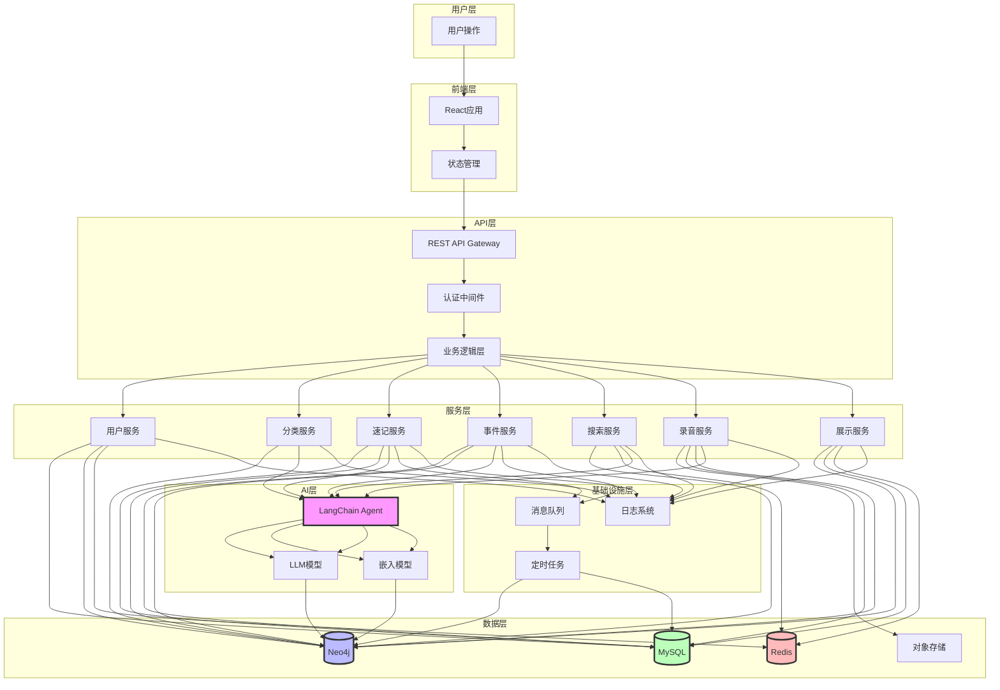
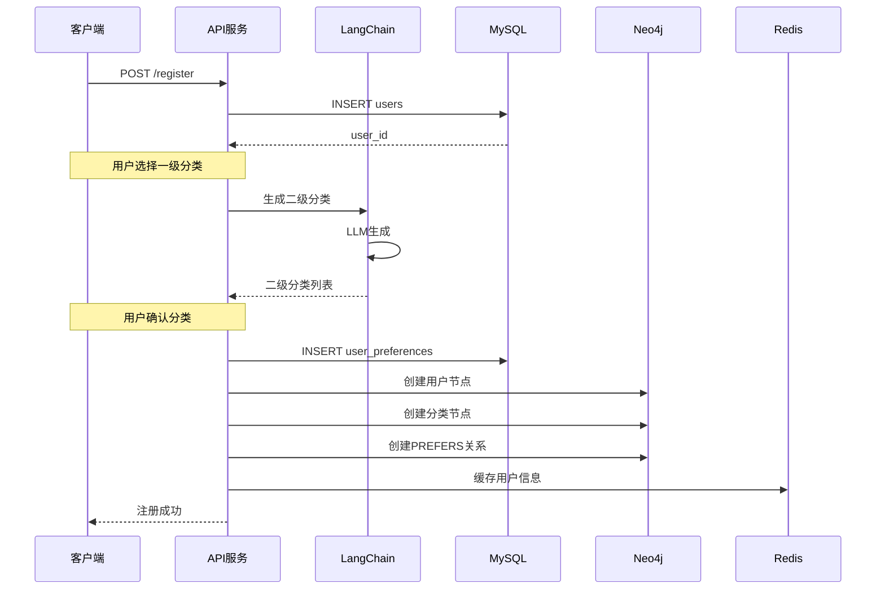
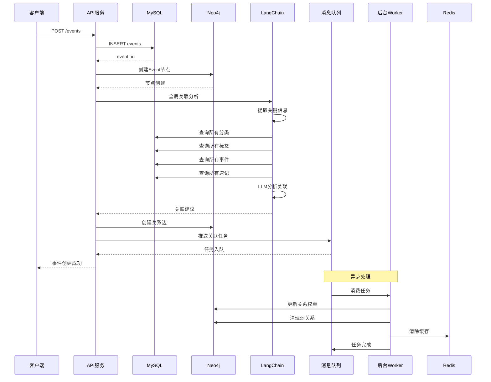
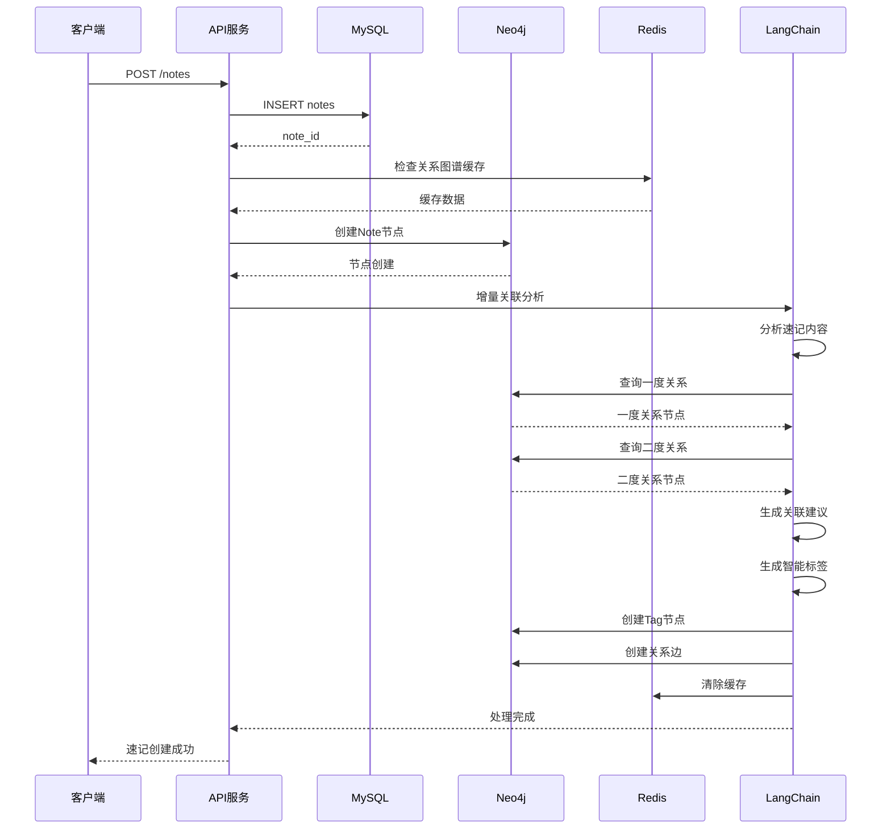
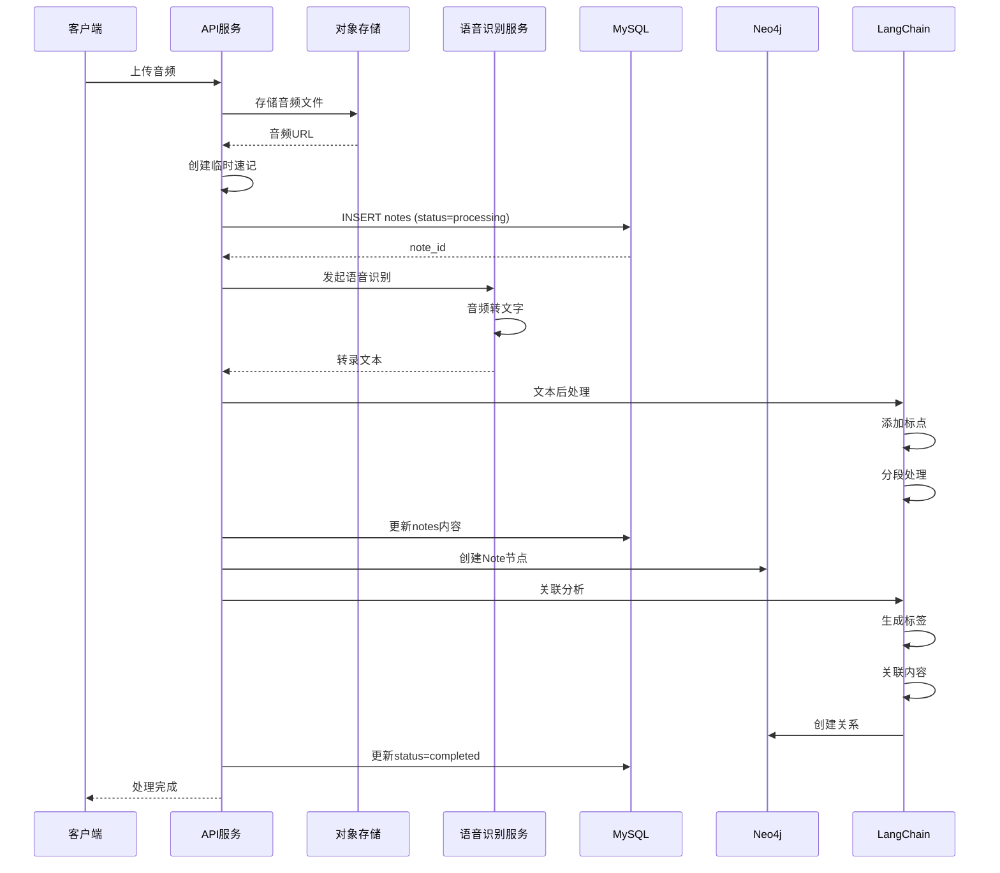
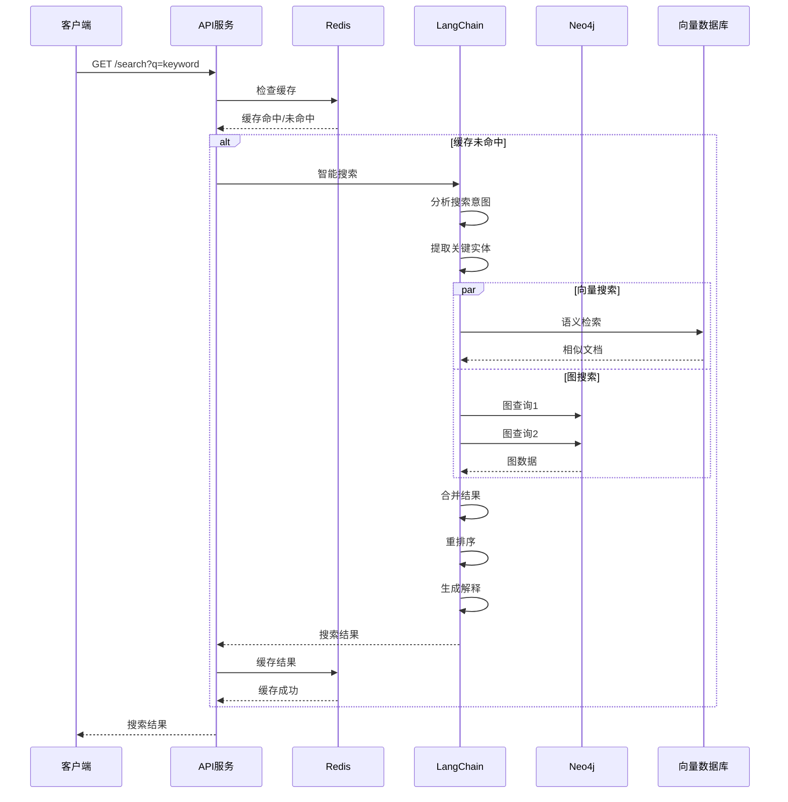
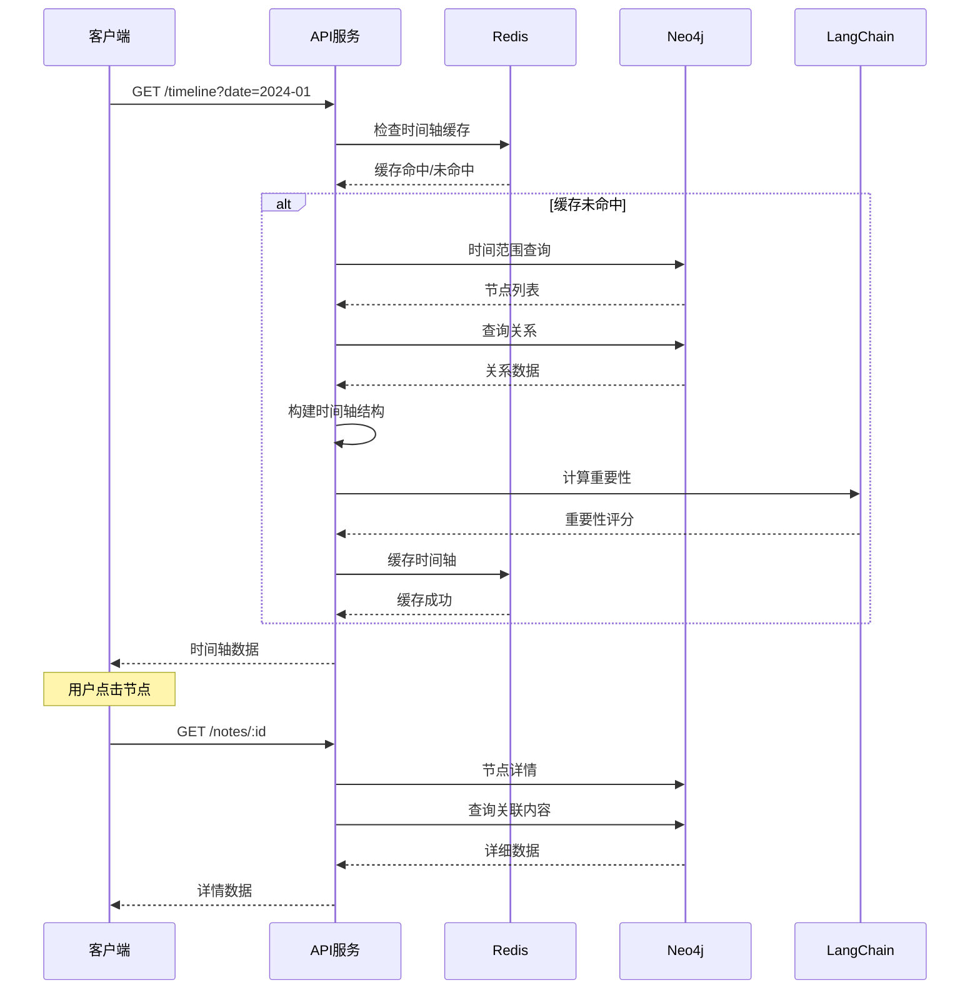

# 完整数据流图



## 核心业务流

### 1. 注册流程数据流



### 2. 事件创建数据流



### 3. 速记创建数据流



### 4. 录音转文字数据流



### 5. 搜索流程数据流



### 6. 展示流程数据流



## 技术栈集成关系

### MySQL数据模型

```sql
-- 用户相关
users (id, username, email, password_hash, ...)
user_preferences (id, user_id, categories, created_at)

-- 内容相关
notes (id, user_id, title, content, source, audio_url, ...)
events (id, user_id, title, event_type, status, priority, ...)
audio_recordings (id, note_id, audio_url, transcript_text, ...)

-- 任务相关
relation_tasks (id, entity_type, entity_id, status, ...)
transcript_segments (id, recording_id, text, start_time, ...)
```

### Neo4j图模型

```cypher
-- 节点类型
(:User)
(:Category)
(:Tag)
(:Event)
(:Note)
(:Audio)

-- 关系类型
(:User)-[:PREFERS]->(:Category)
(:User)-[:CREATED]->(:Event)
(:User)-[:CREATED]->(:Note)
(:Note)-[:BELONGS_TO]->(:Category)
(:Event)-[:BELONGS_TO]->(:Category)
(:Note)-[:TAGGED_WITH]->(:Tag)
(:Event)-[:RELATED_TO]->(:Note)
(:Note)-[:RELATED_TO]->(:Event)
(:Note)-[:CONTAINS]->(:Audio)
(:Event)-[:DEPENDS_ON]->(:Event)
(:Event)-[:BLOCKS]->(:Event)
(:Note)-[:MENTIONS]->(:Event)
```

### Redis数据结构

```
-- 用户缓存
user:{user_id}:info {json}
user:{user_id}:timeline {json}
user:{user_id}:relationships {json}

-- 分类缓存
category:tree {json}
category:{category_id}:notes {list}
category:{category_id}:children {json}

-- 搜索缓存
search:{hash} {json} (TTL: 5min)
search:history:{user_id} {list}

-- 会话缓存
session:{session_id} {json} (TTL: 24h)
```

### LangChain Agent工具链

```python
# 分类生成Agent
Tools:
- 查询一级分类列表
- LLM基于一级分类生成二级分类
- LLM推荐热门分类
- 推送到Neo4j创建节点

# 关联分析Agent（全局）
Tools:
- 查询所有分类
- 查询所有标签
- 查询所有事件
- 查询所有速记
- LLM分析语义相似度
- LLM判断因果/依赖关系

# 关联分析Agent（增量）
Tools:
- 从缓存/Neo4j读取用户图谱
- LLM分析新内容与图谱关联
- 提取一度关系
- 计算二度关系潜力
- 生成连接建议

# 标签生成Agent
Tools:
- 分析内容关键词
- 查询现有标签
- LLM生成新标签
- LLM匹配现有标签
- 推送创建Tag节点

# 搜索Agent
Tools:
- 分析搜索意图
- 向量相似度搜索
- Neo4j图查询
- 结果合并与重排
- 生成搜索解释
```

## 系统关键指标

### 性能指标
- API响应时间: < 500ms (P95)
- 搜索响应时间: < 1s (P95)
- 录音转文字: < 30s (10分钟音频)
- 关联分析: < 5s (单条速记)

### 可用性指标
- 系统可用性: 99.9%
- 数据一致性: 强一致性
- 缓存命中率: > 80%

### 数据规模
- 单用户节点数: < 10,000
- 单用户关系数: < 50,000
- 搜索索引: 全文索引 + 向量索引
```
